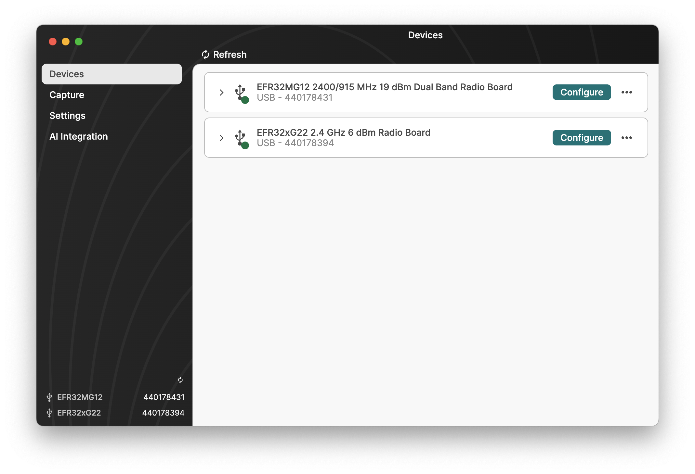

# Simplicity Device Manager - SDM

Simplicity Device Manager is the new hardware management tool of Silicon Labs, which can

- configure and flash devices,
- trace radio packets,
- support other Silicon Labs Software Tools with device access.

## Setup

1. Download and Run **[Simplicity Installer](https://www.silabs.com/software-and-tools/simplicity-studio?tab=getting-started)**
2. Select **Advanced** or **Installation Wizard** and **Advanced**, depending on your current installs
3. Choose and install latest **Simplicity Device Manager**

#### Windows:

- Executable name: `sdm-gui.exe`
- Location: `C:\Users\<username>\.silabs\slt\installs\archive\sdm-darwin-x64\simplicity-device-manager`

#### macOS:

- Executable name: `Simplicity Device Manager.app`
- Location:
  - `~/.silabs/slt/installs/archive/sdm-darwin-arm64/simplicity-device-manager` (Apple Silicon)
  - `~/.silabs/slt/installs/archive/sdm-darwin-x64/simplicity-device-manager` (Intel)

#### Linux:

- Executable name: `sdm-gui`
- Location: `~/.silabs/slt/installs/archive/sdm-darwin-x64/simplicity-device-manager`

## Setup - CLI

1. Download **[Silicon Labs Tool (SLT)](https://www.silabs.com/software-and-tools/simplicity-studio/configurator-command-line-development?tab=getting-started)** command line tool
1. Install `./slt install sdm`
3. Launch `./slt launch device_manager`

**Note:** On Windows, use `.\slt.exe`

## Documentation

See [docs.silabs.com](https://docs.silabs.com/device-manager/latest/device-manager-getting-started-overview/)

## License

The default license is the [Master Software License Agreement (MSLA)](https://www.silabs.com/about-us/legal/master-software-license-agreement), which applies unless otherwise noted.
